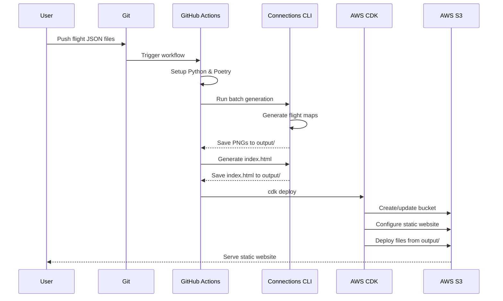

# Design Document

## Overview

This design extends the connections CLI tool to support batch processing of flight data and integrates with AWS CDK and GitHub Actions to automatically generate flight maps and deploy them to AWS S3 for static website hosting. The system maintains the existing single-file generation capability while adding batch processing and cloud deployment features.

The architecture separates concerns into three main components:
1. **CLI Tool**: Generates flight maps locally (single or batch mode)
2. **CDK Infrastructure**: Defines and manages S3 bucket and static website configuration
3. **GitHub Action Workflow**: Orchestrates map generation and CDK deployment

## Architecture

### High-Level Architecture

```
┌─────────────────────────────────────────────────────────────┐
│                     GitHub Repository                        │
│  ┌──────────────┐         ┌──────────────────────────────┐ │
│  │ flights/     │         │ .github/workflows/           │ │
│  │  - trip1.json│────────▶│   deploy.yml                 │ │
│  │  - trip2.json│         └──────────┬───────────────────┘ │
│  └──────────────┘                    │                      │
│  ┌──────────────┐                    │                      │
│  │ cdk/         │                    │                      │
│  │  - app.py    │◀───────────────────┘                      │
│  │  - stack.py  │                                           │
│  └──────────────┘                                           │
└─────────────────────────────────────────────────────────────┘
                                       │
                                       ▼
                        ┌──────────────────────────┐
                        │  GitHub Actions Runner   │
                        │  ┌────────────────────┐  │
                        │  │ 1. Install Poetry  │  │
                        │  │ 2. Generate Maps   │  │
                        │  │ 3. Generate Index  │  │
                        │  │ 4. CDK Deploy      │  │
                        │  └────────────────────┘  │
                        └──────────┬───────────────┘
                                   │
                                   ▼
                        ┌──────────────────────────┐
                        │      AWS S3 Bucket       │
                        │  ┌────────────────────┐  │
                        │  │  index.html        │  │
                        │  │  trip1.png         │  │
                        │  │  trip2.png         │  │
                        │  └────────────────────┘  │
                        │  (Static Website)        │
                        └──────────────────────────┘
```

### Component Interaction



## Components and Interfaces

### 1. CLI Module Extensions (src/connections/main.py)

**New Command: `batch`**

Generates multiple flight maps from a directory of JSON files.

```python
@click.command()
@click.option("--input-directory", "-d", type=click.Path(exists=True), required=True)
@click.option("--output-directory", "-o", type=str, required=True)
def batch(input_directory: str, output_directory: str) -> None:
    """Generate flight maps for all JSON files in a directory"""
    pass
```

**Existing Command: `render`** (unchanged)

Maintains backward compatibility for single-file generation.

### 2. Index Page Generator (src/connections/index.py)

**New Module** for generating HTML index pages.

```python
class IndexGenerator:
    """Generates HTML index page for flight maps"""
    
    def __init__(self, template_path: Optional[str] = None):
        """Initialize Jinja2 environment"""
        pass
    
    def generate(self, maps: List[MapMetadata], output_path: str) -> None:
        """Generate HTML from template and map metadata, save to file"""
        pass
    
    def scan_output_directory(self, directory: str) -> List[MapMetadata]:
        """Scan directory for PNG files and extract metadata"""
        pass
```

**MapMetadata Model:**

```python
@dataclass
class MapMetadata:
    title: str
    filename: str
    relative_path: str  # Relative path for HTML links
```

### 3. Batch Processor (src/connections/batch.py)

**New Module** for batch processing logic.

```python
class BatchProcessor:
    """Processes multiple flight JSON files"""
    
    def __init__(self, input_dir: str, output_dir: str):
        pass
    
    def process_all(self) -> List[str]:
        """Process all JSON files and return list of generated file paths"""
        pass
    
    def _process_single(self, json_path: str) -> str:
        """Process a single JSON file"""
        pass
```

### 4. CDK Infrastructure (cdk/)

**New CDK App** for infrastructure management (TypeScript).

**cdk/bin/flight-map.ts** (CDK entry point):

```typescript
#!/usr/bin/env node
import 'source-map-support/register';
import * as cdk from 'aws-cdk-lib';
import { FlightMapStack } from '../lib/flight-map-stack';

const app = new cdk.App();
new FlightMapStack(app, 'FlightMapStack', {
  env: {
    account: process.env.CDK_DEFAULT_ACCOUNT,
    region: process.env.CDK_DEFAULT_REGION || 'us-east-1',
  },
});
```

**cdk/lib/flight-map-stack.ts** (Infrastructure definition):

```typescript
import * as cdk from 'aws-cdk-lib';
import * as s3 from 'aws-cdk-lib/aws-s3';
import * as s3deploy from 'aws-cdk-lib/aws-s3-deployment';
import { Construct } from 'constructs';

export class FlightMapStack extends cdk.Stack {
  constructor(scope: Construct, id: string, props?: cdk.StackProps) {
    super(scope, id, props);

    // Create S3 bucket for static website
    const bucket = new s3.Bucket(this, 'FlightMapBucket', {
      websiteIndexDocument: 'index.html',
      publicReadAccess: true,
      blockPublicAccess: s3.BlockPublicAccess.BLOCK_ACLS,
      removalPolicy: cdk.RemovalPolicy.DESTROY,
      autoDeleteObjects: true,
    });

    // Deploy generated files to S3
    new s3deploy.BucketDeployment(this, 'DeployFlightMaps', {
      sources: [s3deploy.Source.asset('../output')],
      destinationBucket: bucket,
    });

    // Output the website URL
    new cdk.CfnOutput(this, 'WebsiteURL', {
      value: bucket.bucketWebsiteUrl,
      description: 'Flight maps website URL',
    });
  }
}
```

## Data Models

### Existing Models (Unchanged)

- `Coordinates`: Latitude/longitude pair
- `Flight`: Flight route with IATA codes
- `FlightMap`: Map visualization class

### New Models

**MapMetadata** (for index generation):

```python
@dataclass
class MapMetadata:
    title: str           # Map title (from filename)
    filename: str        # PNG filename
    relative_path: str   # Relative path for HTML links (e.g., "./trip1.png")
```

## Correctness Properties

*A property is a characteristic or behavior that should hold true across all valid executions of a system—essentially, a formal statement about what the system should do. Properties serve as the bridge between human-readable specifications and machine-verifiable correctness guarantees.*

### Property 1: Batch Processing Completeness

*For any* directory containing N valid JSON files, batch processing should generate exactly N PNG files.

**Validates: Requirements 2.1, 2.2**

### Property 2: Filename Consistency

*For any* JSON file with name "X.json", the generated map should be named "X.png" and use "X" as the default title.

**Validates: Requirements 2.3, 2.4**

### Property 3: Error Isolation

*For any* batch containing both valid and invalid JSON files, processing should complete successfully for all valid files and log warnings for invalid files without failing the entire batch.

**Validates: Requirements 2.5, 2.6, 8.1**

### Property 4: Index Page File Generation

*For any* output directory containing N PNG files, the generated index.html file should list exactly N maps with their titles and relative paths.

**Validates: Requirements 4.1, 4.3, 4.4**

### Property 5: Filename to Title Mapping in Index

*For any* PNG file named "X.png" in the output directory, the index page should display "X" as the title.

**Validates: Requirements 4.4, 2.3**

### Property 6: CDK Deployment Completeness

*For any* output directory containing N files (PNGs + index.html), CDK deployment should upload all N files to S3.

**Validates: Requirements 3.4, 3.5**

### Property 7: Public Accessibility

*For any* file deployed via CDK, the file should be publicly accessible via the S3 website URL without authentication.

**Validates: Requirements 3.8**

### Property 9: Directory Creation

*For any* output directory that does not exist, the system should create it before attempting to write files.

**Validates: Requirements 8.3**

### Property 10: HTML Link Correctness

*For any* PNG file in the output directory, the index page should contain a clickable link with the correct relative path to that file.

**Validates: Requirements 4.3**

## Error Handling

### CLI Error Handling

1. **Invalid JSON Files**: Log warning with filename and parsing error, continue processing
2. **Invalid IATA Codes**: Log warning with code and flight details, skip that flight
3. **Missing Output Directory**: Create directory automatically
4. **File Write Failures**: Display error message and exit with code 1

### GitHub Actions Error Handling

1. **AWS Authentication Failures**: Fail workflow with descriptive error
2. **S3 Upload Failures**: Retry up to 3 times with exponential backoff
3. **Bucket Configuration Failures**: Fail workflow with AWS error details
4. **Missing Secrets**: Fail workflow with clear message about required secrets

### Error Exit Codes

- `0`: Success
- `1`: General error (file I/O, parsing)
- `2`: AWS authentication error
- `3`: S3 operation error

## Testing Strategy

### Unit Tests

**Existing Tests** (maintain coverage):
- `test_main.py`: CLI command tests
- `test_model.py`: Flight and Coordinates tests
- `test_map.py`: FlightMap generation tests

**New Tests**:
- `test_batch.py`: Batch processing logic
- `test_index.py`: Index page generation and directory scanning

### Property-Based Tests

Property-based tests will use the `hypothesis` library to generate random test data and verify universal properties across many inputs (minimum 100 iterations per test).

**Test Configuration**:
```python
from hypothesis import given, settings
import hypothesis.strategies as st

@settings(max_examples=100)
@given(...)
def test_property_name(...):
    # Property test implementation
    pass
```

Each property test must include a comment tag referencing the design property:
```python
# Feature: flight-map-generator, Property 1: Batch Processing Completeness
```

### Integration Tests

- End-to-end batch processing with sample data
- Index page generation with real output directory
- CDK synthesis test (verify CloudFormation template generation)

### CDK Testing

- Use CDK assertions to verify stack resources
- Test bucket configuration (website hosting, public access)
- Test BucketDeployment construct configuration
- Snapshot tests for CloudFormation template

## Implementation Notes

### Dependencies

**New Dependencies** (add to pyproject.toml):
- `boto3` (^1.34.0): AWS SDK for Python
- `jinja2` (^3.1.0): Template engine for HTML generation
- `hypothesis` (^6.98.0): Property-based testing library (dev dependency)
- `moto` (^5.0.0): AWS service mocking for tests (dev dependency)

### GitHub Actions Workflow

**File**: `.github/workflows/deploy.yml`

**Trigger**: Push to `main` branch with changes in `flights/` directory

**Steps**:
1. Checkout repository
2. Setup Python 3.10+
3. Install Poetry
4. Install dependencies
5. Generate flight maps (batch mode)
6. Configure AWS credentials (OIDC recommended, fallback to secrets)
7. Upload maps to S3
8. Generate and upload index page

**Required GitHub Secrets**:
- `AWS_ACCESS_KEY_ID` (if not using OIDC)
- `AWS_SECRET_ACCESS_KEY` (if not using OIDC)
- `AWS_S3_BUCKET` (bucket name)
- `AWS_REGION` (default: us-east-1)

**Recommended**: Use GitHub OIDC provider for AWS authentication instead of long-lived credentials for enhanced security.

### HTML Template

**Location**: `src/connections/templates/index.html.j2`

**Features**:
- Responsive design
- Thumbnail grid layout
- Click to view full-resolution
- Display title and upload date
- Reverse chronological ordering

### S3 Bucket Policy

```json
{
  "Version": "2012-10-17",
  "Statement": [
    {
      "Sid": "PublicReadGetObject",
      "Effect": "Allow",
      "Principal": "*",
      "Action": "s3:GetObject",
      "Resource": "arn:aws:s3:::BUCKET_NAME/*"
    }
  ]
}
```

### Repository Structure

```
connections/
├── flights/                    # Flight data directory
│   ├── trip1.json
│   ├── trip2.json
│   └── ...
├── .github/
│   └── workflows/
│       └── deploy.yml         # GitHub Actions workflow
├── src/connections/
│   ├── main.py               # CLI (extended)
│   ├── model.py              # Data models (unchanged)
│   ├── map.py                # Map generation (unchanged)
│   ├── batch.py              # NEW: Batch processor
│   ├── s3.py                 # NEW: S3 uploader
│   ├── index.py              # NEW: Index generator
│   └── templates/
│       └── index.html.j2     # NEW: HTML template
├── tests/
│   ├── test_batch.py         # NEW
│   ├── test_s3.py            # NEW
│   └── test_index.py         # NEW
└── pyproject.toml            # Updated dependencies
```
